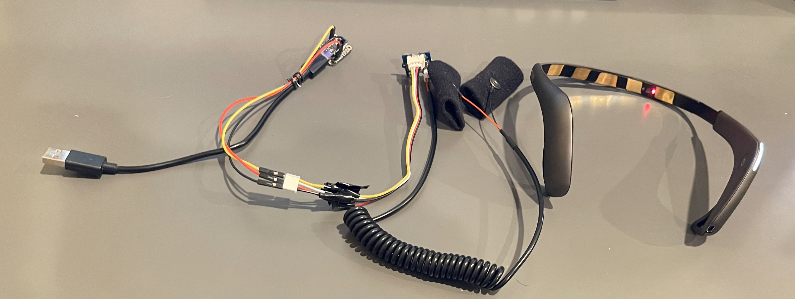
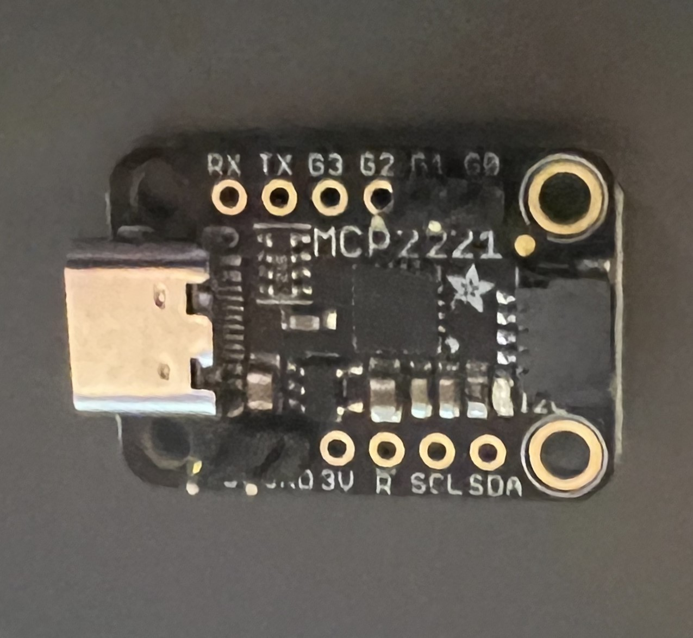
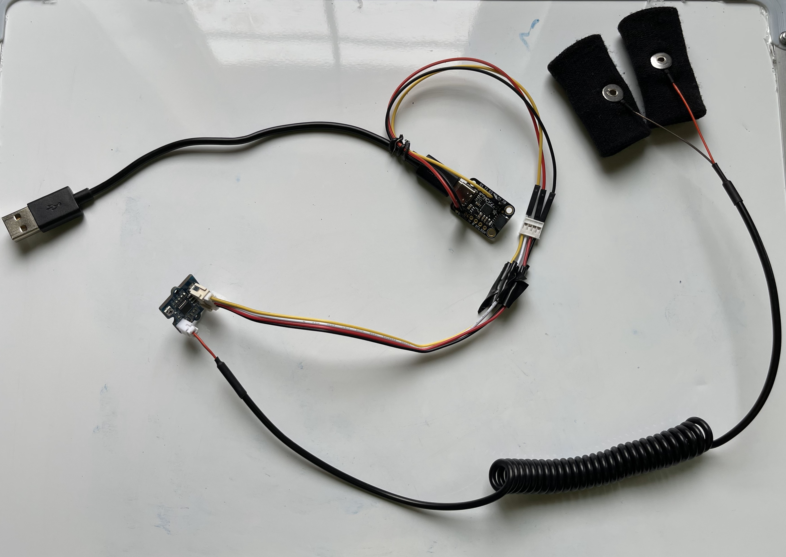

# Multi-Sensor Biometric Monitor

**Stress Analysis on Computer Users using Biometric Sensors and Eye Tracking** — a non-intrusive wearable that detects rising stress in real time by fusing EEG, heart-rate (PPG), skin conductance (GSR), and webcam-based eye-blink data. Built for the 2023 Alameda County Science & Engineering Fair (HS-SOFT-222).

## Why

64% of U.S. adults report acute work-related stress, linked to over 100,000 stress-related deaths a year. This project set out to detect rising stress non-invasively, early enough to act on it — using sensors a person could plausibly wear at a desk.

## What it does

- Streams EEG from a 5-electrode wireless headband and 2 PPG sensors in real time
- Reads galvanic skin response (GSR) from finger sensors
- Detects eye blinks via webcam using OpenCV and dlib facial-landmark tracking
- Runs multi-layer noise filtering across all four signal streams
- Visualizes everything live through a PyQt6 / pyqtgraph dashboard
- Includes stress-induction test scripts (cold-pressor and mental-arithmetic tasks) used to validate the device against known stress responses

## Results

Across induced-stress testing, four metrics moved consistently and predictably with rising stress:

| Metric | Change under stress | Why |
|---|---|---|
| Heart-rate variability (HRV, SD1) | ~60% average increase | Stress hormones alter autonomic heart rhythm |
| Skin conductance (GSR) | 4.8%–7.7% increase | Increased sweating lowers skin resistance |
| Blink rate | ~50–75% decrease | Higher concentration/focus suppresses blinking |
| EEG alpha/theta ratio | Median dropped from ~3 to ~1 | Less relaxation (alpha), more focus (theta) |

Combining all four signals successfully predicted a user's stress-level change, and stayed accurate even with moderate movement — the original failure mode for single-sensor approaches. Next step: a reinforcement-learning layer that improves predictions from user feedback over time.

*(Full methodology and the official abstract are summarized above; raw session data is in `data/`.)*

## Hardware

<p>
  
  
  
</p>

Custom sensor headband (EEG + PPG) paired with finger-mounted GSR electrodes and a custom ADC board for signal acquisition; eye-blink tracking runs off the built-in webcam.

## Data

`data/` contains representative recorded session files for EEG, GSR, PPG, raw PPG, and blink-rate measurements. Live runs write new timestamped CSV files into this directory.

The eye-blink detector also requires dlib's `shape_predictor_68_face_landmarks.dat` file. Place that file in `data/` before starting webcam-based blink tracking; it is not included in this repository.

## Running it

### Hardware and software prerequisites

- Muse 2 headband paired and available to BrainFlow
- MCP2221-based GSR circuit, connected over USB
- Working webcam for eye-blink tracking
- Python 3 and the packages in `requirements.txt`
- Additional hardware support packages for `board`, `analogio`, and `hid`; these are platform- and device-specific and are not currently listed in `requirements.txt`

Install the listed Python packages from the repository root:

```bash
pip install -r requirements.txt
```

Run the live pipeline from the repository root:

```bash
python3 src/main.py
```

> `src/main.py` currently starts the blink process with the Windows-only `start /wait` command. On macOS or Linux, the launcher needs to be updated to use the platform's Python subprocess invocation before the full pipeline will run.

> `dlib` needs a manual build step on Windows rather than a plain `pip install` — see dlib's own installation instructions if `pip install dlib` fails. On every platform, download `shape_predictor_68_face_landmarks.dat` separately and place it in `data/`.

The checked-in CSV files can be used for inspection without connecting the hardware. The live scripts are hardware-dependent and do not currently provide a simulated-data mode.

## Built with

Python · OpenCV · dlib · BrainFlow · PyQt6 / pyqtgraph · imutils · scipy
